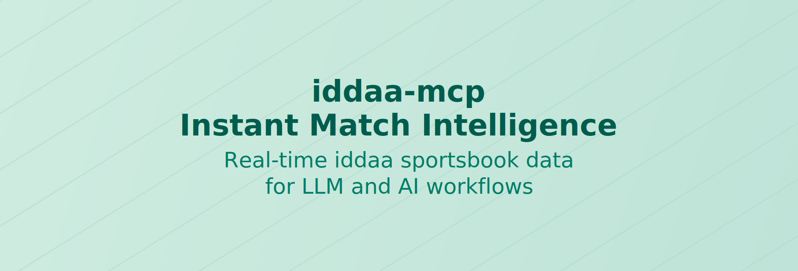

# iddaa-mcp



`iddaa-mcp` gives you a focused MCP integration for iddaa sportsbook data with local and remote transport support.

Documentation site: https://borakilicoglu.github.io/iddaa-mcp/

## npm Package

This project is published on npm as [`iddaa-mcp`](https://www.npmjs.com/package/iddaa-mcp).

Install it with:

```bash
npm install -g iddaa-mcp
```

## Features

- `iddaa` data tools ready to use:
  - `get_competitions`
  - `get_events`
  - `get_detailed_events`
  - `get_highlighted_events`
  - `get_league_fixture`
- Multiple transport support:
  - `stdio` (default, local development)
  - `http` (`/mcp` endpoint for remote/local clients)
  - `sse` (deprecated)
- Type-safe tool schemas with `zod`.
- MCP client integration via `.cursor/mcp.json`.
- Build and runtime flow with `pnpm`.
- League fixture + strategy simulation in one tool (`get_league_fixture`).

## Language Support

- Default response language is Turkish (`tr`).
- You can set `locale: "en"` in tool arguments for English output.
- Supported values: `tr`, `en`.

Example:

```json
{
  "tool": "get_highlighted_events",
  "arguments": {
    "limit": 5,
    "locale": "en"
  }
}
```

## `get_league_fixture` Quick Notes

- Supported leagues:
  - `Bundesliga`
  - `Premier League`
  - `Serie A`
  - `Super League`
  - `League 1`
  - `La Liga`
- `week` behavior:
  - If `week` is provided, only that week is fetched.
  - If `week` is omitted or `null`, all weeks are fetched (`1..totalWeeks`).
- Null payload retry:
  - If server returns `null`, the same request is retried up to `4` times.
- Strategy behavior:
  - `strategy` is optional: `martingale | fibonacci | none`.
  - If `strategy` is omitted, no strategy summary is generated.
  - If `strategy` is provided and `baseBet` is omitted, `baseBet` defaults to `50`.
- Comeback filter behavior:
  - `comeback` is optional (`true | false`).
  - If `comeback=true`, only halftime-leader reversals are returned (`1->2` and `2->1`).
  - `comeback=true` cannot be used with `strategy=martingale|fibonacci`.

Example:

```json
{
  "tool": "get_league_fixture",
  "arguments": {
    "league": "Super League",
    "strategy": "martingale"
  }
}
```

Comeback example:

```json
{
  "tool": "get_league_fixture",
  "arguments": {
    "league": "Super League",
    "comeback": true
  }
}
```

## Getting Started

### Prerequisites

- [Node.js](https://nodejs.org/) (Specify version if necessary)
- An MCP-compatible client (e.g., [Cursor](https://cursor.com/))

## Usage

### Supported Transport Options

Model Context Protocol Supports multiple Transport methods.

### stdio

Recommend for local setups

#### Code Editor Support

Add the code snippets below

- Cursor: `.cursor/mcp.json`

**Local development/testing**

Use this if you want to test your mcp server locally

```json
{
  "mcpServers": {
    "iddaa-mcp-stdio": {
      "command": "node",
      "args": ["./bin/cli.mjs", "--stdio"]
    }
  }
}
```

**Published Package**

Use this when you have published your package in the npm registry

```json
{
  "mcpServers": {
    "iddaa-mcp-stdio": {
      "command": "npx",
      "args": ["iddaa-mcp", "--stdio"]
    }
  }
}
```

### Streamable HTTP

> Important: Streamable HTTP is not supported in Cursor yet

Recommend for remote server usage

**Important:** In contrast to stdio you need also to run the server with the correct flag

**Local development**
Use the `streamable http` transport

1. Start the MCP Server
   Run this in your terminal

```bash
node ./bin/cli.mjs --http --port 4200
```

Or with mcp inspector

```bash
pnpm run dev-http
# pnpm run dev-sse (deprecated)
```

2. Add this to your config

```json
{
  "mcpServers": {
    "iddaa-mcp-http": {
      "command": "node",
      "args": ["./bin/cli.mjs", "--http", "--port", "4001"]
      // "args": ["./bin/cli.mjs", "--sse", "--port", "4002"] (or deprecated sse usage)
    }
  }
}
```

**Published Package**

Use this when you have published your package in the npm registry

Run this in your terminal

```bash
npx iddaa-mcp --http --port 4200
# npx iddaa-mcp --sse --port 4201 (deprecated)
```

```json
{
  "mcpServers": {
    "iddaa-mcp-http": {
      "url": "http://localhost:4200/mcp"
      // "url": "http://localhost:4201/sse"
    }
  }
}
```

## Use the Inspector

Use the `inspect` command to debug your mcp server

## Command-Line Options

### Protocol Selection

| Protocol | Description        | Flags                                                         | Notes      |
| :------- | :----------------- | :------------------------------------------------------------ | :--------- |
| `stdio`  | Standard I/O       | (None)                                                        | Default    |
| `http`   | HTTP REST          | `--port <num>` (def: 3000), `--endpoint <path>` (def: `/mcp`) |            |
| `sse`    | Server-Sent Events | `--port <num>` (def: 3000)                                    | Deprecated |

## License

This project is licensed under the MIT License - see the LICENSE file for details.
