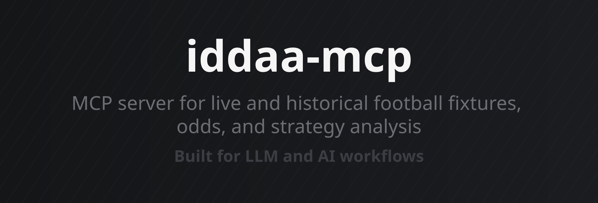

<p align="center">
  
</p>

<p align="center">
  <b>Real-time iddaa sportsbook data for your MCP workflows.</b>
</p>

<p align="center">
  <a href="https://www.npmjs.com/package/iddaa-mcp"></a>
  <a href="./LICENSE"></a>
  <a href="https://www.npmjs.com/package/iddaa-mcp"></a>
  <a href="https://packagephobia.com/result?p=iddaa-mcp"></a>
</p>

---

## ⚡ What is iddaa-mcp?

`iddaa-mcp` is an MCP server that gives you structured access to:

- live and upcoming sportsbook events
- competitions and leagues
- detailed match data
- highlighted events
- historical league fixtures

👉 Built for AI agents, automation, and developer workflows.

---

## 🚀 Quick Start

Run instantly:

```bash
npx iddaa-mcp --stdio
```

---

## 🧠 What you get

- clean, structured sportsbook data
- MCP-compatible tools
- ready-to-use endpoints for agents
- localized responses (`tr`, `en`)

---

## 🔥 Why use it?

Instead of:

- scraping sportsbook data
- handling inconsistent APIs
- writing custom parsers

👉 just plug into MCP and use ready tools.

---

## ⚡ Available Tools

- `get_competitions`
- `get_events`
- `get_detailed_events`
- `get_highlighted_events`
- `get_league_fixture`

---

## 🧠 Example

```json
{
  "tool": "get_highlighted_events",
  "arguments": {
    "limit": 5,
    "locale": "en"
  }
}
```

---

## 📊 League Fixture + Strategy

`get_league_fixture` supports:

- full season data
- weekly queries
- comeback analysis (`1→2`, `2→1`)
- optional strategies:
  - `martingale`
  - `fibonacci`

Example:

```json
{
  "tool": "get_league_fixture",
  "arguments": {
    "league": "Bundesliga",
    "strategy": "martingale"
  }
}
```

---

## 🌐 Transport Options

### stdio (default)

Best for local MCP clients like Cursor:

```json
{
  "mcpServers": {
    "iddaa-mcp-stdio": {
      "command": "npx",
      "args": ["iddaa-mcp", "--stdio"]
    }
  }
}
```

---

### HTTP (remote / local server)

Start server:

```bash
npx iddaa-mcp --http --port 4200
```

Connect:

```json
{
  "mcpServers": {
    "iddaa-mcp-http": {
      "url": "http://localhost:4200/mcp"
    }
  }
}
```

---

## 🌍 Language Support

- default: `tr`
- optional: `en`

```json
{
  "locale": "en"
}
```

---

## ⚙️ Features

- MCP-native tool system
- stdio + HTTP support
- structured and predictable outputs
- type-safe schemas (`zod`)
- league fixture analysis
- strategy simulation
- AI-ready responses

---

## 📦 Install

```bash
npm install -g iddaa-mcp
```

or:

```bash
npx iddaa-mcp --stdio
```

---

## 🧠 Use Cases

- AI betting assistants
- sports data automation
- odds analysis pipelines
- MCP-based agents
- research & strategy testing

---

## 💡 Philosophy

> Give AI and developers clean, structured access to sportsbook data.

---

## ❤️ Support

If this tool helps you:

⭐ Star the repo  
☕ Support via GitHub Sponsors

https://github.com/sponsors/borakilicoglu

---

## 🔗 Links

- GitHub: https://github.com/borakilicoglu/iddaa-mcp
- npm: https://www.npmjs.com/package/iddaa-mcp
